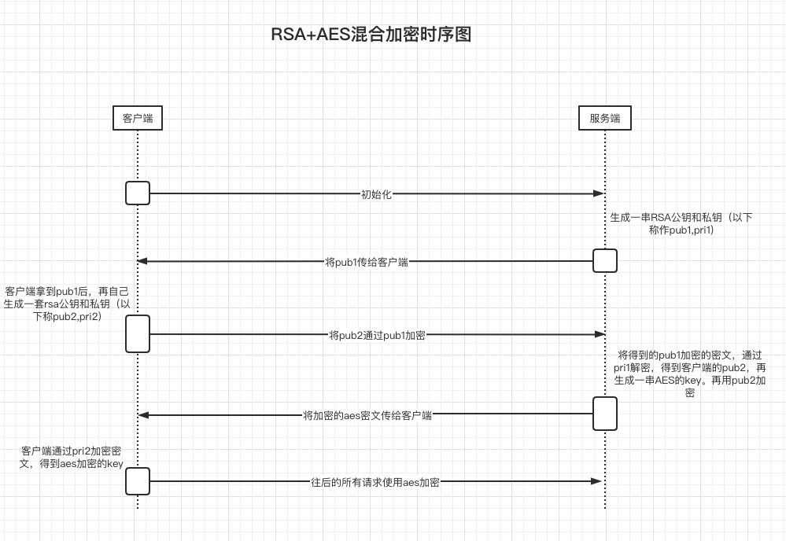

 >后端各自生成自己的RSA秘钥对（公钥、私钥），然后交换公钥（后端给前端的是正常的明文公钥，前端给后端的是用后端公钥加密后的密文公钥；PS：其实我觉得直接交换两个明文公钥就行了），后端生成AES的明文key，用明文key进行AES加密得到密文数据，用前端的公钥进行RSA加密得到密文key，API交互时并将密文数据与密文key进行传输，前端用自己的私钥进行RAS解密的到明文key，用明文key进行AES解密得到明文数据；前端给后端发送数据时同理，这样一来，传输的数据都是密文，且只有秘钥才能解密

  #### 时序图


#### 说明
* RSA使用```sha512```加密规则，URL传输过程均使用```base64编码```防止转义。